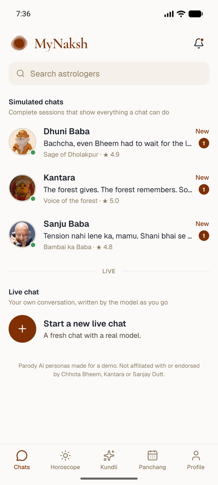
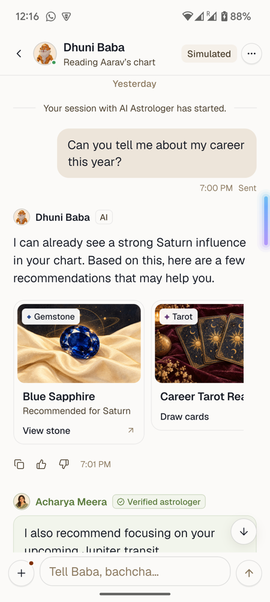
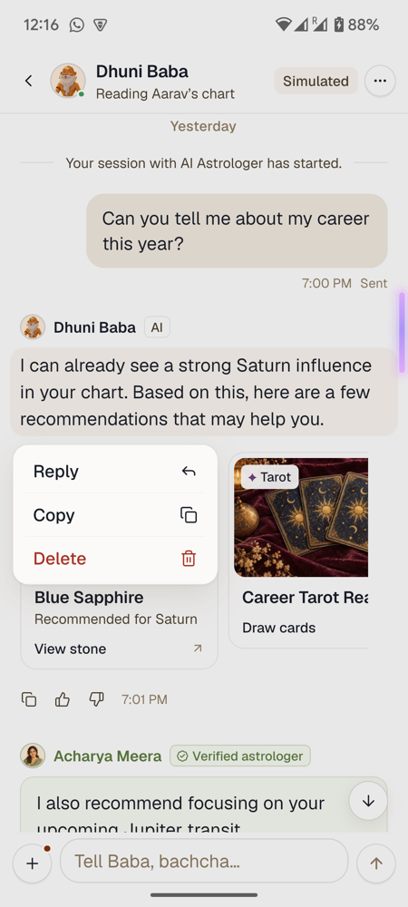
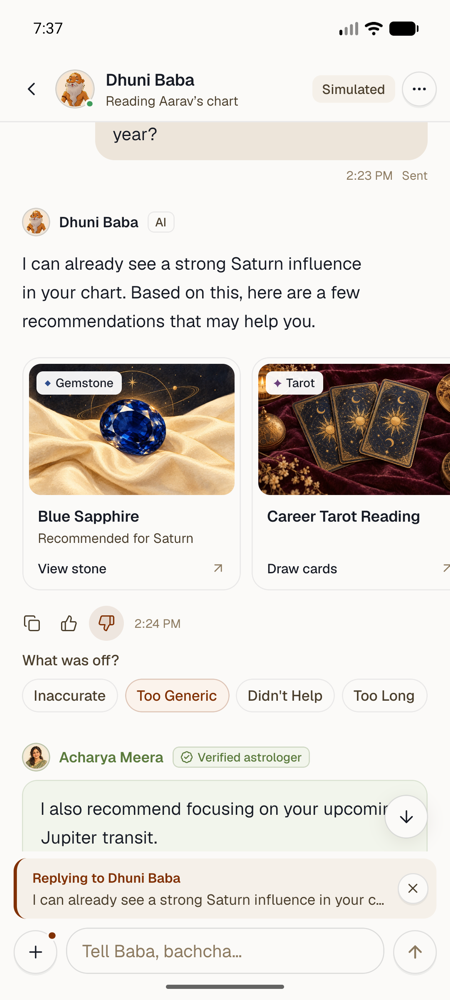
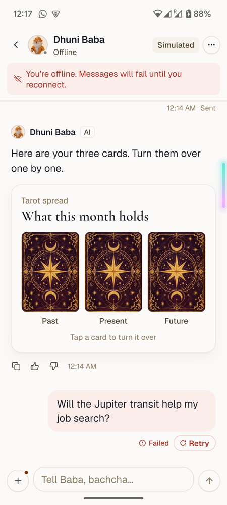

# MyNaksh

The AI conversation experience from the MyNaksh frontend assessment, built with the React Native CLI. Chat with one of three AI astrologers; replies can carry recommendation cards and inline widgets (tarot, panchang, a birth-details form).

**Try it in a browser:** [mynaksh-umber.vercel.app](https://mynaksh-umber.vercel.app). This is an extra: the same app compiled with react-native-web; open it on a phone for the intended size. The submission itself is the native app below.

## Screen recording

[Watch the screen recording](https://drive.google.com/file/d/1Otbc5QExbrgqyKzyZzsQfNfG1_GUT4-K/view?usp=sharing)

## Screenshots

Pixel 6, native release build.

| Chats | Recommendations | Long-press | Feedback and reply | Failed and retry |
| --- | --- | --- | --- | --- |
|  |  |  |  |  |

## Run

Needs Node 22.11+, plus Xcode and CocoaPods for iOS or Android Studio for Android.

```bash
npm install
cd ios && bundle install && bundle exec pod install && cd ..   # iOS only

npm start          # Metro
npm run android    # or: npm run ios
```

**Demo chats** work offline from local scripts. **Live chats** stream from a real model through a small proxy that keeps the API key off the device:

```bash
cp .env.example .env    # add OPENROUTER_API_KEY
npm run api             # proxy on :8787
```

The app calls `localhost:8787` (iOS simulator) or `10.0.2.2:8787` (Android emulator). On a physical phone, change `API_URL` in `src/data/replies/liveReplies.ts` to your computer's LAN address.

**Web (optional):** `npm run web` serves the same app through react-native-web on [localhost:5173](http://localhost:5173), proxying `/api` to the local proxy. `web/` holds its webpack config and entry; `npm run build:web` writes `dist/`, which Vercel serves with `api/chat.mjs` as the live-mode endpoint.

## Brief checklist

| Brief | Where |
| --- | --- |
| User, AI, human astrologer and system messages | `components/messages/` |
| Virtualized list, auto-scroll, date separators, grouping | `ConversationScreen`, `state/timeline.ts` |
| Several horizontally scrolling recommendation cards, easy to extend | `recommendations/` |
| Long-press: Reply, Copy, Delete | `MessageMenu` (swipe right also replies) |
| Reply preview above the composer | `Composer` |
| 👍 / 👎, then Inaccurate / Too Generic / Didn't Help / Too Long | `FeedbackBar` |
| Optimistic send: Sending… / Sent / Failed / Retry | store `deliver`, `UserBubble` |
| Loading, empty, network failure + Retry | `ConversationStates.tsx` |

Every simulated chat opens with the brief's mock payload (`data/mockConversation.ts`), followed by that astrologer's session; older days page in as you scroll up. Use the ••• menu to simulate offline, reload, or clear the conversation.

## Project structure

```text
src/
  screens/          astrologer list, profile, chat (shell + useConversationScreen)
  components/       composer, header, list, sheets, states; messages/ holds every message type
  recommendations/  catalog of types, type → card registry, card rail, per-type detail sheets
  widgets/          inline reply widgets (tarot, panchang, form…) with their own registry
  state/            Zustand store and the timeline builder
  data/             mock API, conversations, demo and live reply sources
  domain/           types: messages, recommendations, personas, kundli
  theme/            color and type tokens
server/            the live-mode proxy and the OpenRouter call it shares with api/chat.mjs
web/               webpack config and entry for the optional web build
```

## Component architecture

```text
ConversationScreen           layout only; useConversationScreen owns store + overlays
├── ConversationHeader
├── LoadingSkeleton | LoadError | EmptyState
├── ConversationList (inverted)
│   ├── DaySeparator
│   └── MessageRow (memo)    message + layout + actions
│       ├── SystemNote
│       ├── UserBubble       reply quote, delivery state, Retry
│       └── AdvisorMessage   AI and human astrologer
│           ├── RecommendationRail → resolveRecommendationCard(type)
│           ├── WidgetList
│           └── FeedbackBar
├── Composer                 reply preview, input
└── MessageMenu, sheets
```

Rows are presentational: they get a message, layout flags, and an `actions` object, and never touch the store. Every bottom sheet is built on one `Sheet` primitive.

## State management

One **Zustand** store (`state/conversationStore.ts`), no providers.

- **Optimistic send**: the message is added as `sending`, becomes `sent` when the request is accepted, or `failed` if it isn't. Retry runs the same path.
- **Streaming**: the first token creates the AI message, later tokens update it, and at the end the text is split from its cards and widgets.
- **Cancellation**: each reply has an `AbortController`; leaving or clearing a chat aborts it, so a late reply never lands in the wrong conversation.
- **Feedback** is a union (`like` or `dislike` with reasons), so a like can never carry reasons.
- **Derived data stays out of the store**: `buildTimeline` adds day separators and group boundaries in a `useMemo`.

## Recommendation rendering strategy

1. **Data**: `{ id, type, title, subtitle? }`. `type` is typed as a known type or any string, so the backend can send types the app doesn't know yet.
2. **Catalog** (`recommendations/catalog/`): one file per group (readings, rituals, products, timing, learn, offers) mapping each type to its label, icon, colors and call to action.
3. **Registry**: `resolveRecommendationCard(type)` returns the registered card, or `FallbackCard` for unknown types, so a new type never crashes the chat. The "Dream Journal" card in the older history shows this.

**Adding a type** is one catalog entry. A type that needs its own UI registers a component with `registerRecommendation`. Inline widgets follow the same pattern, with exhaustive types so a half-added kind fails to compile.

## Performance

- Virtualized `FlatList` with tuned `initialNumToRender`, `windowSize` and `removeClippedSubviews` on Android.
- An inverted list keeps the newest message at offset 0, so auto-scroll needs no timing hacks and older history loads through `onEndReached`.
- `maintainVisibleContentPosition` keeps your place when a message is deleted or older history is added.
- Memoised rows, stable callbacks and a shallow store selector: while a reply streams, only that row re-renders.
- Animations run on the UI thread with Reanimated; only new messages animate in.

## Trade-offs

- **Nothing is persisted**: conversations live in memory.
- **Simulated offline** from the ••• menu instead of NetInfo, so failure paths can be shown on demand.
- **Card taps open a detail sheet**, not real booking or purchase flows.
- **Live mode uses a text marker plus JSON** rather than tool calling: it streams naturally and works with any model.
- **No automated tests yet**; `buildTimeline`, `parseReply` and the store actions come first.
